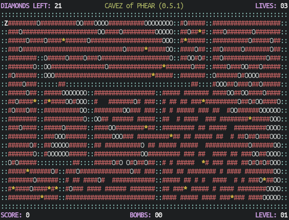

<a href="https://repology.org/project/cavezofphear/versions">
	
</a>

[](https://github.com/AMDmi3/cavezofphear/actions/workflows/ci.yml)
[](https://github.com/AMDmi3/cavezofphear)

# CAVEZ of PHEAR



You are trapped in the CAVEZ of PHEAR, your mission is to escape
through all the caves and make it out alive. To escape through a
cave you will have to find all the diamonds located in it. Once
you've found all the diamonds, their powers combined will help you
get to the next cave, one step closer to freedom.

## How to play

By picking up a diamond `*` you get 10 points, picking up money `$`
gives you 100 points. You get one extra life for every 1000 points
you score.

Move around with the arrow keys or the 2-4-8-6 keys. Press *k* to 
commit suicide if you should get stuck.

Got the bombs (`%`)? Great! Press *b* to place them, and *t* to detonate
them all at once. Note that the bombs you place will act just like
stones, affected by gravity, rolling, and so on..

Watch out for monsters (`M`) -- if they catch you, you will die. To
fight back, drop stones on them or blow them up using your bombs.

Pressing *s* will enable/disable sound, *w* will highlight your
current position.

## Building and installation

To run the game without installing:

```sh
cmake .
cmake --build .
./phear
```

For systemwide installation:

```sh
cmake -DSYSTEMWIDE=ON .
cmake --build .
cmake --install .
```

## Editor

Start the editor with `phear -e <map>`, use `0-9` keys to place
objects, `s` to save the map, `q` to quit and `l` to elabme lock-mode
(lets you traw using arrow-keys). Play your map with `phear <map>`.

## History and credits

The game was originally written by Tom Rune Flo <<tom@x86.no>> with
latest version 0.5.1 published on 2011-11-30. Currently maintained
by [Dmitry Marakasov](https://github.com/AMDmi3) <<amdmi3@amdmi3.ru>>.

## License

CAVEZ of PHEAR is free software: you can redistribute it and/or 
modify it under the terms of the GNU General Public License as
published by the Free Software Foundation, either version 3 of the
License, or (at your option) any later version. See [COPYING](COPYING)
for details.
